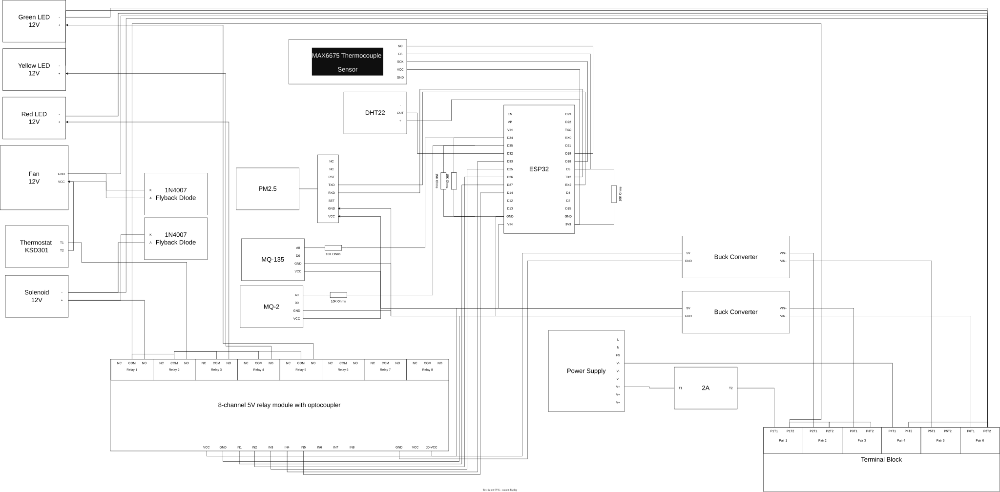

# Hardware Documentation

This directory contains the hardware specifications, schematics, and connection details for the project.

## Schematic Diagram

The schematic diagram is automatically generated from the Draw.io source file.

> **Note:** The SVG above is automatically generated by a GitHub Action whenever `schematics/schematic-diagram.drawio` is updated. To make changes, edit the `.drawio` file and push to the repository.

## Other Documents

- [Components](components.md)
- [Connections](connections.md)
